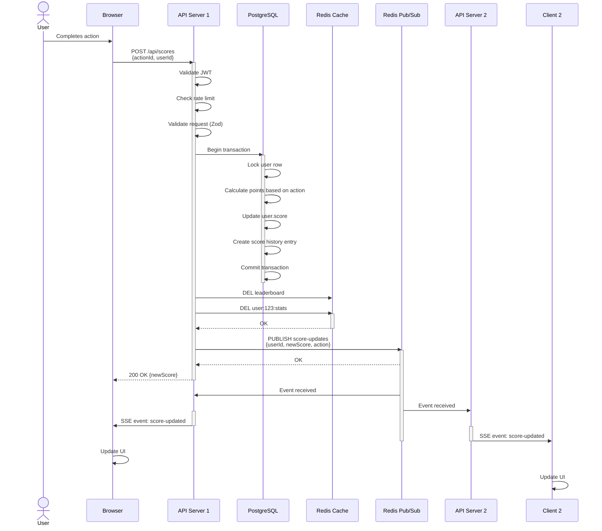
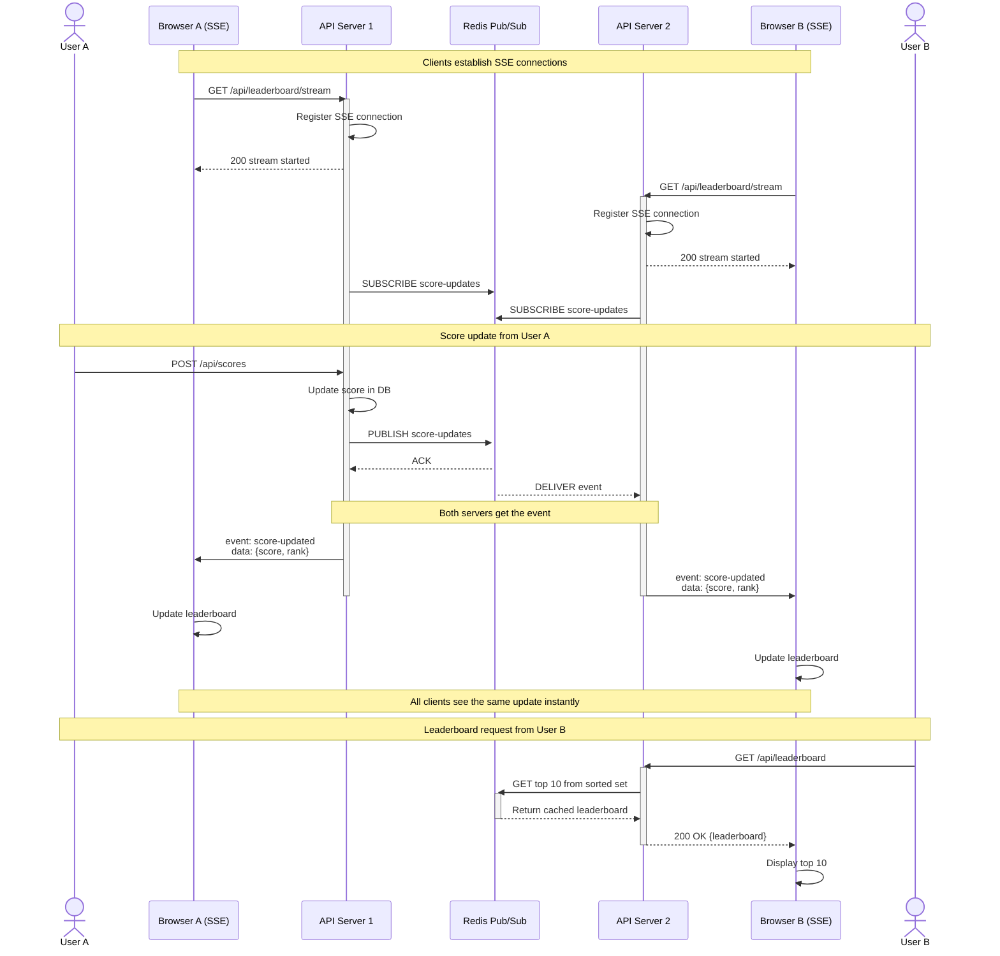

# Architecture & System Design

> Comprehensive guide to the Real-Time Scoreboard API architecture, design decisions, and execution flows

## Table of Contents

1. [High-Level Architecture](#high-level-architecture)
2. [Technology Stack with Rationale](#technology-stack-with-rationale)
3. [Architecture Patterns](#architecture-patterns)
4. [Execution Flow Diagrams](#execution-flow-diagrams)

---

## High-Level Architecture

The Real-Time Scoreboard API follows a **layered monolithic architecture** optimized for real-time updates and horizontal scalability.

```
┌─────────────┐         ┌──────────────────┐         ┌─────────────┐
│   Client    │────────▶│   API Server     │────────▶│ PostgreSQL  │
│  (Browser)  │  POST   │   (Node.js)      │  Write  │   (RDS)     │
└─────────────┘         └──────────────────┘         └─────────────┘
       │                        │                            │
       │ SSE                    │ Pub/Sub                    │
       │ Stream                 │                            │
       │                 ┌──────▼──────┐                     │
       └─────────────────│    Redis    │◀────────────────────┘
                         │ (Cache +    │         Read
                         │  Pub/Sub)   │
                         └─────────────┘
```

### Architecture Layers

**1. Presentation Layer (Client)**
- Browser-based web application
- Sends score updates via HTTP POST
- Receives real-time updates via Server-Sent Events (SSE)
- No direct database access

**2. Application Layer (Node.js API Server)**
- Express.js REST API
- Request validation and authentication
- Business logic orchestration
- SSE connection management
- Rate limiting and security enforcement

**3. Data Layer (Databases)**
- **PostgreSQL (RDS)**: Source of truth for user scores and historical data
- **Redis**: High-speed leaderboard cache, Pub/Sub messaging, session management

### Why This Architecture?

1. **Monolithic REST API** - Simple deployment and management for medium-scale applications (10K concurrent users)
2. **Separation of Concerns** - Clear boundaries between routing, business logic, and data access
3. **Redis Dual Role** - Acts as both cache and message broker, reducing infrastructure complexity
4. **Stateless Servers** - Enables horizontal scaling and load balancing without session affinity
5. **Event-Driven Updates** - Pub/Sub pattern ensures all connected clients receive updates instantly

---

## Technology Stack with Rationale

| Component | Technology | Version | Rationale |
|-----------|-----------|---------|-----------|
| **Runtime** | Node.js | 20.x LTS | Fast async I/O for handling thousands of concurrent connections; excellent ecosystem |
| **Language** | TypeScript | 5.x | Type safety reduces bugs in production; better IDE support and refactoring tools |
| **Framework** | Express.js | 4.18.x | Lightweight, mature, minimal overhead; perfect for REST APIs without framework bloat |
| **Database** | PostgreSQL | 15.x | ACID compliance, reliability, excellent for transactional data; proven at scale |
| **Cache/Pub-Sub** | Redis | 7.0.x | O(1) sorted set operations for leaderboards, native Pub/Sub for real-time broadcasts |
| **ORM** | Prisma | 5.x | Type-safe queries, migration management, excellent TypeScript integration |
| **Authentication** | jsonwebtoken | 9.x | Stateless JWT validation, industry standard, no session storage needed |
| **Validation** | Zod | 3.x | Runtime type validation, TypeScript-first, better error messages than alternatives |
| **Cloud Platform** | AWS | Latest | Proven reliability, ECS for containerization, RDS for managed database, ElastiCache for Redis |

### Key Technology Decisions

#### Why Node.js + Express?
- **Non-blocking I/O**: Perfect for SSE connections that remain open for minutes
- **Event Loop**: Handles thousands of concurrent connections with minimal overhead
- **npm Ecosystem**: Rich package ecosystem for authentication, validation, monitoring
- **Single Language**: Frontend and backend both in JavaScript/TypeScript

#### Why PostgreSQL over NoSQL?
- **Data Integrity**: ACID guarantees critical for score updates
- **Relationships**: User/score relationships require relational structure
- **Transactions**: Complex scoring logic needs atomic operations
- **Proven Scalability**: Works reliably at millions of transactions/day

#### Why Redis for Leaderboard?
- **Sorted Sets**: O(log N) insertion, O(1) top-K queries
- **In-Memory Speed**: Sub-millisecond response times vs. 10-50ms from PostgreSQL
- **Pub/Sub**: Built-in message broker without additional infrastructure
- **Cluster Mode**: Can scale beyond single instance when needed

#### Why Server-Sent Events (SSE)?
- **Simpler than WebSockets**: Server-side easier to implement and debug
- **HTTP-Based**: Works through proxies and firewalls better than WebSockets
- **Auto-Reconnection**: Browser handles disconnections automatically
- **One-Way Streaming**: Perfect fit for one-directional broadcasts
- **Lower Memory**: Each connection uses ~1KB vs. ~10KB for WebSocket

#### Why JWT Authentication?
- **Stateless**: No session storage required, simplifies scaling
- **Cryptographically Signed**: Can't be forged without secret key
- **Token Expiry**: Automatic invalidation without logout logic
- **Standard**: Compatible with most client libraries and security tools

#### Why Zod Validation?
- **Runtime Validation**: Catches invalid requests before business logic
- **TypeScript Integration**: Generates types from schemas automatically
- **Better Errors**: More informative error messages than JSON Schema validation
- **Type Safety**: Compile-time and runtime type checking together

---

## Architecture Patterns

### 1. Repository Pattern

**Purpose**: Abstract database access logic from business logic

**Implementation**:
```
Controller → Service → Repository → Database
```

**Why We Use It**:
- **Testability**: Easy to mock database calls in unit tests
- **Separation of Concerns**: Business logic doesn't depend on database details
- **Flexibility**: Can swap PostgreSQL for another database without changing service logic
- **Code Reuse**: Multiple services can use the same repository

**Example Flow**:
```
ScoreController
  → ScoreService (validates business rules)
    → ScoreRepository (executes queries)
      → Prisma (ORM)
        → PostgreSQL (database)
```

### 2. Pub/Sub Pattern

**Purpose**: Broadcast score updates to all connected clients across multiple server instances

**Components**:
- **Publisher**: ScoreService publishes update event to Redis
- **Subscriber**: Server instances subscribe to Redis channel
- **Event Hub**: Redis acts as central message broker

**Why We Use It**:
- **Decoupling**: Publishers don't need to know about subscribers
- **Scalability**: Works across multiple server instances without shared memory
- **Real-Time**: Sub-millisecond latency for event delivery
- **Reliability**: Redis ensures message delivery (with Pub/Sub extension)

**Flow**:
1. User A sends score update → Server 1
2. Server 1 publishes event to Redis channel "score-updates"
3. All servers (including Server 2, 3, 4) receive event via subscription
4. Each server broadcasts to connected SSE clients
5. All browsers see update instantly

### 3. Server-Sent Events (SSE) Pattern

**Purpose**: Push real-time updates to connected clients without polling

**Key Characteristics**:
- HTTP-based streaming connection (not WebSocket)
- Server sends events; client only receives
- Browser handles reconnection automatically
- Works through proxies and corporate firewalls

**Why We Use It**:
- **Simplicity**: No need for complex WebSocket upgrade protocol
- **Automatic Reconnection**: Browser re-establishes connection if broken
- **Efficient**: Lower overhead than polling (no request headers each time)
- **Debugging**: Use regular HTTP tools (curl, browsers DevTools)

**Connection Lifecycle**:
```
Client                          Server
  │                               │
  ├──GET /api/leaderboard/stream─→│
  │                               │ (Connection open)
  │←─ event: leaderboard ─────────┤
  │ data: {"top10": [...]}        │
  │                               │
  │ (connection stays open)       │
  │                               │
  │←─ event: score-updated ───────┤
  │ data: {"userId": "123", ...}  │
  │                               │
  │ (reconnect after 30s idle)    │
  │                               │
```

### 4. Cache-Aside Pattern

**Purpose**: Improve leaderboard query performance using Redis cache

**Implementation Steps**:

1. **Read Request**:
   - Check Redis for top 10
   - If found (cache hit) → return immediately
   - If not found (cache miss) → query PostgreSQL

2. **Write Request**:
   - Update score in PostgreSQL
   - Invalidate leaderboard cache in Redis
   - Next read request rebuilds cache

**Workflow**:
```
Client Request (GET /api/leaderboard)
  │
  ├─→ Check Redis sorted set
  │
  ├─→ Cache Hit?
  │   ├─ YES → Return cached top 10 (~1ms)
  │   └─ NO → Continue...
  │
  ├─→ Query PostgreSQL
  │   └─ SELECT * FROM scores ORDER BY score DESC LIMIT 10 (~20ms)
  │
  ├─→ Store in Redis
  │   └─ Sorted set key "leaderboard" (~5ms)
  │
  └─→ Return to client (~30ms total)

Score Update (POST /api/scores)
  │
  ├─→ Update in PostgreSQL (~15ms)
  │
  ├─→ Invalidate Cache
  │   └─ DEL "leaderboard" (~1ms)
  │
  ├─→ Publish Event
  │   └─ Redis Pub/Sub to all servers (~2ms)
  │
  └─→ Broadcast to SSE clients (~50-100ms)
```

**Why We Use It**:
- **Performance**: 50x faster leaderboard queries (1ms vs 50ms)
- **Reduced Load**: 90% of requests served from cache
- **Simplicity**: Cache invalidation on write is straightforward
- **Consistency**: PostgreSQL is always source of truth

**Cache Hit Rate**: Expected 85-95% for typical usage patterns

**TTL Strategy**:
- Hard expiry: 5 minutes (fallback for missed invalidations)
- Soft expiry: 30 seconds (check freshness flag)
- Invalidation trigger: Score update in any user

---

## Execution Flow Diagrams

### Score Update Flow

This diagram shows the complete flow from a user action to leaderboard update across all clients.



### Real-Time Streaming Flow

This diagram shows how the leaderboard stays synchronized across multiple clients through SSE.



---

## Key Design Principles

### 1. Single Source of Truth
- PostgreSQL is always the authoritative data store
- Redis cache can be invalidated and rebuilt without data loss
- Score history preserved in PostgreSQL for auditing

### 2. Stateless Servers
- No server-specific state except SSE connections
- Any server can handle any request
- Enables auto-scaling and load balancing

### 3. Fail-Safe Scoring
- All calculations happen server-side
- Never trust client-provided scores
- Rate limiting prevents abuse
- Transactions ensure consistency

### 4. Optimistic UI Updates
- Client shows update immediately on SSE broadcast
- Server processes asynchronously
- Rollback impossible in this design (by choice)

### 5. Monitoring-First Approach
- Every operation is logged and monitored
- Metrics drive optimization decisions
- Alerts prevent SLA breaches

---

## Performance Characteristics

### Latency Targets
- **Score update**: < 50ms (p95)
- **Leaderboard query**: < 10ms (from Redis cache)
- **SSE broadcast**: < 100ms to all clients
- **Database write**: 10-20ms

### Capacity per Instance
- 10,000 concurrent SSE connections
- 100 score updates/second
- 10K leaderboard queries/second
- Handles 50-100 concurrent users per connection

### Bottleneck Analysis
1. **Network latency** - Usually 20-50ms for browser requests
2. **Database writes** - 10-20ms for transaction commit
3. **SSE broadcast** - 50-100ms to reach all clients
4. **Cache invalidation** - < 5ms, negligible

---

## Scaling Strategies

### Horizontal Scaling
```
Load Balancer
    ├─ API Server 1 (SSE connections)
    ├─ API Server 2 (SSE connections)
    ├─ API Server 3 (SSE connections)
    └─ API Server N (SSE connections)
         ↓
    Redis Pub/Sub (shared)
         ↓
    PostgreSQL (RDS with read replicas)
```

### When to Scale
- **Add API servers**: When SSE connections exceed 8K per instance
- **Add read replicas**: When read queries exceed 5K/sec
- **Redis Cluster**: When Pub/Sub throughput exceeds 50K ops/sec

---

## Architecture Decisions Matrix

| Decision | Choice | Alternatives | Trade-off |
|----------|--------|---------------|-----------|
| **API Style** | REST | GraphQL, RPC | Simpler to understand/cache vs. flexible queries |
| **Real-Time** | SSE | WebSocket, Polling | Works through proxies vs. more complex protocol |
| **Cache Strategy** | Cache-Aside | Write-Through, Lazy | Simple invalidation vs. complexity |
| **Database** | PostgreSQL | MySQL, MongoDB | Reliability vs. flexibility |
| **Message Broker** | Redis Pub/Sub | RabbitMQ, SQS | Simple vs. guaranteed delivery |
| **Deployment** | Monolith | Microservices | Easy deployment vs. service independence |

---

## Document Version

- **Version**: 1.0
- **Last Updated**: 2025-12-11
- **Author**: Winston (Architect Agent)
- **Status**: Production-Ready
